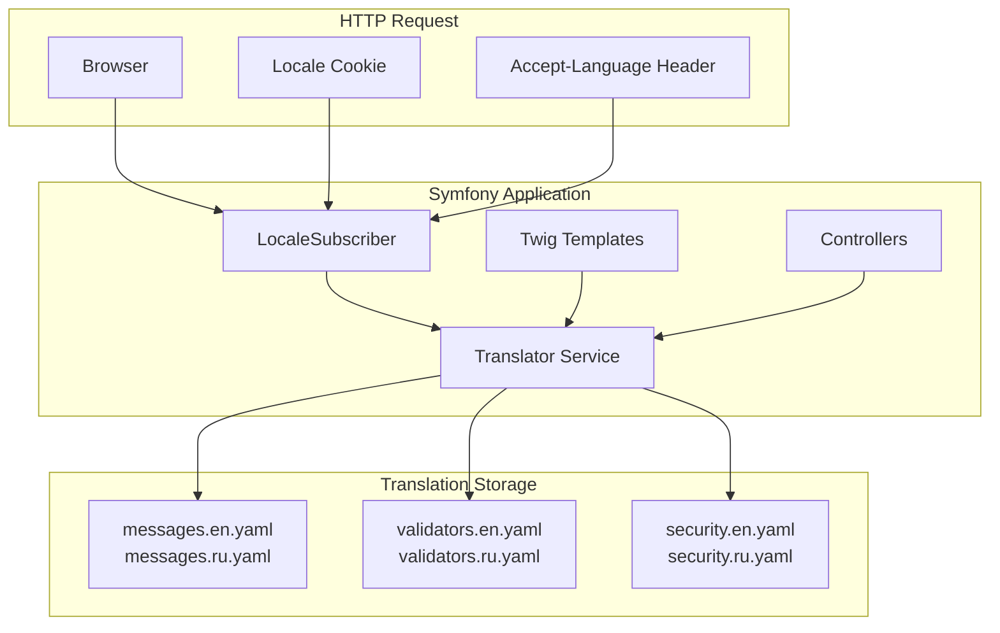

# Design Document: Internationalization (i18n)

## Overview

Интернационализация RexTube реализуется с использованием встроенного компонента Symfony Translation. Система будет поддерживать английский (по умолчанию) и русский языки, с возможностью добавления новых локалей через конфигурацию.

Ключевые принципы:
- URL остаются без префиксов локали
- Язык хранится в cookie (1 год) и сессии
- Все статические тексты выносятся в файлы переводов
- Используется Twig-фильтр `|trans` для перевода в шаблонах

## Architecture



### Поток определения локали

1. `LocaleSubscriber` перехватывает каждый запрос
2. Проверяет наличие cookie `_locale`
3. Если cookie нет — анализирует `Accept-Language` header
4. Если язык не поддерживается — использует `en` по умолчанию
5. Устанавливает локаль в Request и сессию

## Components and Interfaces

### 1. LocaleSubscriber

Event subscriber для определения и установки локали.

```php
namespace App\EventSubscriber;

class LocaleSubscriber implements EventSubscriberInterface
{
    public function __construct(
        private string $defaultLocale,
        private array $supportedLocales
    ) {}
    
    public function onKernelRequest(RequestEvent $event): void;
    public static function getSubscribedEvents(): array;
}
```

### 2. LocaleController

Контроллер для переключения языка.

```php
namespace App\Controller;

class LocaleController extends AbstractController
{
    #[Route('/locale/{locale}', name: 'app_locale_switch')]
    public function switchLocale(
        string $locale,
        Request $request
    ): Response;
}
```

### 3. Twig Extension для локали

Расширение для доступа к информации о локалях в шаблонах.

```php
namespace App\Twig;

class LocaleExtension extends AbstractExtension
{
    public function getAvailableLocales(): array;
    public function getCurrentLocale(): string;
    public function getLocaleName(string $locale): string;
}
```

### 4. Language Switcher Component

Twig-компонент для переключателя языков в header.

```twig
{# templates/partials/_language_switcher.html.twig #}
<div class="language-switcher">
    <button>{{ current_locale_name }}</button>
    <div class="dropdown">
        
            <a href="{{ path('app_locale_switch', {locale: locale, redirect: app.request.uri}) }}">
                {{ locale_name(locale) }}
            </a>
        
    </div>
</div>
```

## Data Models

### Конфигурация локалей

```yaml
# config/packages/translation.yaml
framework:
    default_locale: en
    enabled_locales: ['en', 'ru']
    translator:
        default_path: '%kernel.project_dir%/translations'
        fallbacks: ['en']
```

### Структура файлов переводов

```
translations/
├── messages.en.yaml      # Основные тексты (английский)
├── messages.ru.yaml      # Основные тексты (русский)
├── validators.en.yaml    # Сообщения валидации
├── validators.ru.yaml
├── security.en.yaml      # Сообщения безопасности
└── security.ru.yaml
```

### Формат файла переводов

```yaml
# translations/messages.en.yaml
nav:
    home: "Home"
    videos: "Videos"
    categories: "Categories"
    community: "Community"
    popular: "Popular"
    trending: "Trending"

auth:
    login: "Login"
    logout: "Logout"
    register: "Sign Up"
    my_profile: "My Profile"
    my_videos: "My Videos"
    admin_panel: "Admin Panel"

video:
    views: "{0} views|{1} view|]1,Inf[ views"
    no_videos: "No videos found"
    load_more: "Load more"
    search_placeholder: "Search videos..."

pagination:
    previous: "Previous"
    next: "Next"
    page: "Page %page%"
```

```yaml
# translations/messages.ru.yaml
nav:
    home: "Главная"
    videos: "Видео"
    categories: "Категории"
    community: "Сообщество"
    popular: "Популярное"
    trending: "В тренде"

auth:
    login: "Войти"
    logout: "Выйти"
    register: "Регистрация"
    my_profile: "Мой профиль"
    my_videos: "Мои видео"
    admin_panel: "Админ панель"

video:
    views: "{0} просмотров|{1} просмотр|[2,4] просмотра|[5,Inf[ просмотров"
    no_videos: "Видео не найдено"
    load_more: "Загрузить ещё"
    search_placeholder: "Поиск видео..."

pagination:
    previous: "Назад"
    next: "Вперёд"
    page: "Страница %page%"
```

## Correctness Properties

*A property is a characteristic or behavior that should hold true across all valid executions of a system-essentially, a formal statement about what the system should do. Properties serve as the bridge between human-readable specifications and machine-verifiable correctness guarantees.*

### Property 1: Locale Persistence Round Trip

*For any* supported locale selected by a user, storing it in a cookie and then reading it back on subsequent requests should return the same locale value.

**Validates: Requirements 1.3, 5.1, 5.2**

### Property 2: Browser Locale Detection

*For any* Accept-Language header containing a supported locale, the system should detect and apply that locale; for unsupported locales, the system should fall back to the default locale (English).

**Validates: Requirements 1.1, 1.4**

### Property 3: URL Preservation on Locale Switch

*For any* URL path and query parameters, switching the locale should redirect to the same URL without adding locale prefixes, preserving all original path segments and query parameters.

**Validates: Requirements 2.3, 2.4, 5.4**

### Property 4: Translation Key Fallback

*For any* non-existent translation key, the translator should return the key itself as the fallback value.

**Validates: Requirements 3.2**

### Property 5: Message Translation Consistency

*For any* translation key that exists in all supported locales, requesting the translation in a specific locale should return the value from that locale's catalog, not from another locale.

**Validates: Requirements 1.2, 6.1, 6.2, 6.3**

### Property 6: Locale-Aware Date Formatting

*For any* date value and supported locale, formatting the date should produce output consistent with that locale's conventions (e.g., "December 27, 2025" for English, "27 декабря 2025" for Russian).

**Validates: Requirements 8.1, 8.3**

### Property 7: Locale-Aware Number Formatting

*For any* numeric value and supported locale, formatting the number should use the locale's decimal and thousand separators (e.g., "1,234.56" for English, "1 234,56" for Russian).

**Validates: Requirements 8.2**

## Error Handling

### Неподдерживаемая локаль

Если пользователь пытается установить неподдерживаемую локаль:
- Система игнорирует запрос
- Сохраняет текущую локаль
- Логирует попытку для мониторинга

### Отсутствующий перевод

Если ключ перевода отсутствует:
- В dev-режиме: показывается ключ + warning в профайлере
- В prod-режиме: показывается ключ (fallback)
- Логируется для последующего добавления перевода

### Некорректный cookie

Если cookie `_locale` содержит невалидное значение:
- Система использует Accept-Language header
- Если и он не помогает — fallback на `en`
- Cookie перезаписывается корректным значением

## Testing Strategy

### Unit Tests

1. **LocaleSubscriber Tests**
   - Тест определения локали из cookie
   - Тест определения локали из Accept-Language
   - Тест fallback на default locale

2. **LocaleController Tests**
   - Тест переключения на валидную локаль
   - Тест отклонения невалидной локали
   - Тест сохранения redirect URL

3. **LocaleExtension Tests**
   - Тест получения списка доступных локалей
   - Тест получения имени локали

### Property-Based Tests

Для property-based тестирования используется библиотека **PHPUnit с Data Providers** для генерации тестовых данных.

1. **Property 1: Locale Persistence Round Trip**
   - Генерация случайных поддерживаемых локалей
   - Проверка сохранения и восстановления из cookie

2. **Property 3: URL Preservation**
   - Генерация случайных URL с query parameters
   - Проверка сохранения после смены локали

3. **Property 5: Message Translation Consistency**
   - Генерация случайных ключей из каталога
   - Проверка соответствия переводов локалям

4. **Property 6 & 7: Locale-Aware Formatting**
   - Генерация случайных дат и чисел
   - Проверка форматирования по локали

### Integration Tests

1. Полный цикл смены языка через UI
2. Проверка отображения переведённых страниц
3. Проверка форм с локализованной валидацией
