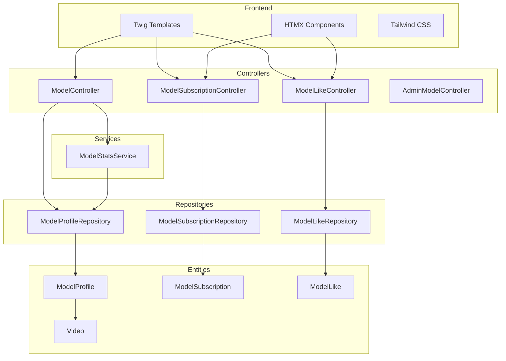
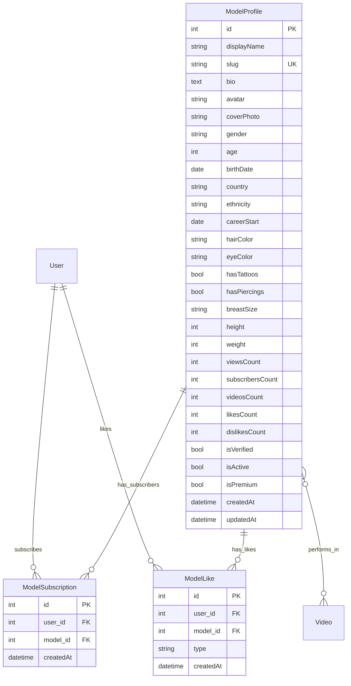

# Дизайн-документ: Раздел моделей (Порноактёры)

## Обзор

Данный документ описывает техническую архитектуру и дизайн раздела моделей для платформы RexTube. Раздел включает публичные страницы просмотра моделей, систему подписок на моделей, систему лайков/дизлайков и расширение админ-панели.

## Архитектура

### Общая структура



### Маршруты

| Маршрут | Метод | Контроллер | Описание |
|---------|-------|------------|----------|
| `/models` | GET | ModelController::index | Список моделей |
| `/models/{slug}` | GET | ModelController::show | Профиль модели |
| `/model/subscribe/{id}` | POST | ModelSubscriptionController::toggle | Подписка/отписка |
| `/model/like/{id}/{type}` | POST | ModelLikeController::toggle | Лайк/дизлайк |
| `/admin/models` | GET | AdminModelController::index | Админ: список |
| `/admin/models/new` | GET/POST | AdminModelController::new | Админ: создание |
| `/admin/models/{id}/edit` | GET/POST | AdminModelController::edit | Админ: редактирование |
| `/admin/models/{id}/delete` | POST | AdminModelController::delete | Админ: удаление |

## Компоненты и интерфейсы

### Контроллеры

#### ModelController

```php
#[Route('/models')]
class ModelController extends AbstractController
{
    #[Route('/', name: 'app_models')]
    public function index(Request $request): Response
    // Параметры: page, sort (popular|newest|alphabetical|videos), search, gender
    
    #[Route('/{slug}', name: 'app_model_show')]
    public function show(string $slug, Request $request): Response
    // Отображает профиль модели и её видео с пагинацией
}
```

#### ModelSubscriptionController

```php
#[Route('/model/subscribe')]
class ModelSubscriptionController extends AbstractController
{
    #[Route('/{id}', name: 'model_subscription_toggle', methods: ['POST'])]
    #[IsGranted('ROLE_USER')]
    public function toggle(ModelProfile $model): Response
    // Переключает подписку, возвращает обновлённую кнопку через HTMX
}
```

#### ModelLikeController

```php
#[Route('/model/like')]
class ModelLikeController extends AbstractController
{
    #[Route('/{id}/{type}', name: 'model_like_toggle', methods: ['POST'])]
    #[IsGranted('ROLE_USER')]
    public function toggle(ModelProfile $model, string $type): Response
    // type: 'like' | 'dislike'
    // Переключает оценку, возвращает обновлённые кнопки через HTMX
}
```

### Сервисы

#### ModelStatsService

```php
class ModelStatsService
{
    public function incrementViewCount(ModelProfile $model, ?User $user, SessionInterface $session): void
    // Увеличивает счётчик просмотров с защитой от накрутки через сессию
    
    public function getZodiacSign(\DateTimeInterface $birthDate): ?string
    // Вычисляет знак зодиака по дате рождения
    
    public function calculateAge(\DateTimeInterface $birthDate): int
    // Вычисляет возраст по дате рождения
    
    public function updateVideosCount(ModelProfile $model): void
    // Пересчитывает количество видео модели
}
```

## Модели данных

### ModelProfile (существующая сущность - расширение)

Сущность уже существует с необходимыми полями. Требуется добавить поле `dislikesCount`:

```php
#[ORM\Column]
private ?int $dislikesCount = 0;
```

### ModelSubscription (новая сущность)

```php
#[ORM\Entity(repositoryClass: ModelSubscriptionRepository::class)]
#[ORM\Table(name: 'model_subscription')]
#[ORM\UniqueConstraint(name: 'unique_model_subscription', columns: ['user_id', 'model_id'])]
class ModelSubscription
{
    #[ORM\Id]
    #[ORM\GeneratedValue]
    #[ORM\Column]
    private ?int $id = null;

    #[ORM\ManyToOne(targetEntity: User::class)]
    #[ORM\JoinColumn(nullable: false, onDelete: 'CASCADE')]
    private ?User $user = null;

    #[ORM\ManyToOne(targetEntity: ModelProfile::class)]
    #[ORM\JoinColumn(nullable: false, onDelete: 'CASCADE')]
    private ?ModelProfile $model = null;

    #[ORM\Column]
    private ?\DateTimeImmutable $createdAt = null;
}
```

### ModelLike (новая сущность)

```php
#[ORM\Entity(repositoryClass: ModelLikeRepository::class)]
#[ORM\Table(name: 'model_like')]
#[ORM\UniqueConstraint(name: 'unique_model_like', columns: ['user_id', 'model_id'])]
class ModelLike
{
    public const TYPE_LIKE = 'like';
    public const TYPE_DISLIKE = 'dislike';

    #[ORM\Id]
    #[ORM\GeneratedValue]
    #[ORM\Column]
    private ?int $id = null;

    #[ORM\ManyToOne(targetEntity: User::class)]
    #[ORM\JoinColumn(nullable: false, onDelete: 'CASCADE')]
    private ?User $user = null;

    #[ORM\ManyToOne(targetEntity: ModelProfile::class)]
    #[ORM\JoinColumn(nullable: false, onDelete: 'CASCADE')]
    private ?ModelProfile $model = null;

    #[ORM\Column(length: 10)]
    private ?string $type = self::TYPE_LIKE;

    #[ORM\Column]
    private ?\DateTimeImmutable $createdAt = null;
}
```

### Диаграмма связей



## Свойства корректности

*Свойство корректности - это характеристика или поведение, которое должно выполняться для всех допустимых выполнений системы. Свойства служат мостом между человекочитаемыми спецификациями и машинно-проверяемыми гарантиями корректности.*

### Property 1: Сортировка моделей корректна
*Для любого* списка моделей и любого критерия сортировки (popular, newest, alphabetical, videos), результирующий список должен быть отсортирован согласно выбранному критерию.
**Validates: Requirements 1.3**

### Property 2: Поиск моделей возвращает релевантные результаты
*Для любого* поискового запроса, все модели в результатах должны содержать поисковый запрос в поле displayName (без учёта регистра).
**Validates: Requirements 1.4**

### Property 3: Фильтрация по полу корректна
*Для любого* фильтра по полу, все модели в результатах должны иметь указанный пол.
**Validates: Requirements 1.5**

### Property 4: Видео модели принадлежат этой модели
*Для любой* модели, все видео отображаемые на её странице профиля должны содержать эту модель в коллекции performers.
**Validates: Requirements 2.4**

### Property 5: Подписка корректно обновляет счётчик
*Для любой* модели и любого пользователя, после подписки счётчик subscribersCount должен увеличиться на 1, после отписки - уменьшиться на 1.
**Validates: Requirements 3.1, 3.2**

### Property 6: Состояние кнопки подписки соответствует наличию подписки
*Для любого* авторизованного пользователя и любой модели, если существует запись ModelSubscription, кнопка должна показывать "Отписаться", иначе "Подписаться".
**Validates: Requirements 3.4**

### Property 7: Лайки/дизлайки корректно обновляют счётчики
*Для любой* модели и любого пользователя:
- Лайк увеличивает likesCount на 1
- Дизлайк увеличивает dislikesCount на 1
- Смена лайка на дизлайк уменьшает likesCount на 1 и увеличивает dislikesCount на 1
- Повторный клик на текущую оценку удаляет её и уменьшает соответствующий счётчик на 1
**Validates: Requirements 4.1, 4.2, 4.3, 4.4**

### Property 8: Просмотры корректно подсчитываются с защитой от накрутки
*Для любой* модели и любой сессии пользователя, первый просмотр профиля увеличивает viewsCount на 1, повторные просмотры в той же сессии не увеличивают счётчик.
**Validates: Requirements 5.1, 5.2**

### Property 9: Slug генерируется корректно
*Для любого* имени модели, автоматически сгенерированный slug должен быть валидным URL-совместимым значением (только латинские буквы, цифры и дефисы, в нижнем регистре).
**Validates: Requirements 6.3**

### Property 10: Привязка/отвязка модели к видео обновляет счётчик
*Для любой* модели, при привязке к видео videosCount увеличивается на 1, при отвязке - уменьшается на 1.
**Validates: Requirements 7.2, 7.3**

### Property 11: Meta-теги профиля модели корректны
*Для любой* модели, страница профиля должна содержать meta title с именем модели и meta description с информацией о модели.
**Validates: Requirements 8.2**

## Обработка ошибок

### Ошибки контроллеров

| Ситуация | HTTP код | Действие |
|----------|----------|----------|
| Модель не найдена по slug | 404 | NotFoundException |
| Неавторизованный пользователь пытается подписаться/лайкнуть | 401 | Редирект на login |
| Невалидный тип лайка | 400 | BadRequestException |
| Модель неактивна | 404 | NotFoundException |

### Валидация данных

- Slug должен быть уникальным
- DisplayName обязателен и не более 100 символов
- Gender должен быть одним из: 'male', 'female', 'trans'
- Height и Weight должны быть положительными числами
- BirthDate не может быть в будущем

## Стратегия тестирования

### Подход к тестированию

Используется двойной подход: юнит-тесты для конкретных примеров и property-based тесты для проверки универсальных свойств.

### Библиотека для Property-Based Testing

**PHPUnit с eris/eris** - библиотека для property-based testing в PHP.

```bash
composer require --dev eris/eris
```

### Юнит-тесты

- Тесты репозиториев (поиск, фильтрация, сортировка)
- Тесты сервисов (вычисление возраста, знака зодиака)
- Тесты контроллеров (HTTP responses)

### Property-Based тесты

Каждый property-based тест должен:
- Запускаться минимум 100 итераций
- Содержать комментарий с ссылкой на свойство корректности
- Использовать генераторы для создания тестовых данных

Формат комментария:
```php
/**
 * **Feature: models-section, Property 1: Сортировка моделей корректна**
 * **Validates: Requirements 1.3**
 */
```

### Структура тестов

```
tests/
├── Property/
│   └── Model/
│       ├── ModelSortingPropertyTest.php
│       ├── ModelSearchPropertyTest.php
│       ├── ModelFilterPropertyTest.php
│       ├── ModelSubscriptionPropertyTest.php
│       ├── ModelLikePropertyTest.php
│       ├── ModelViewCountPropertyTest.php
│       └── ModelSlugPropertyTest.php
└── Unit/
    └── Model/
        ├── ModelStatsServiceTest.php
        └── ModelProfileRepositoryTest.php
```

## Шаблоны

### Структура шаблонов

```
templates/
└── model/
    ├── index.html.twig          # Список моделей
    ├── show.html.twig           # Профиль модели
    ├── _card.html.twig          # Карточка модели
    ├── _subscribe_button.html.twig  # Кнопка подписки
    └── _like_buttons.html.twig  # Кнопки лайков
```

### Переводы

Добавить ключи в `translations/messages.*.yaml`:
- `models.title`, `models.search`, `models.sort.*`, `models.filter.*`
- `model.profile.*`, `model.stats.*`, `model.subscribe`, `model.unsubscribe`
- `model.like`, `model.dislike`, `model.videos`, `model.info.*`
