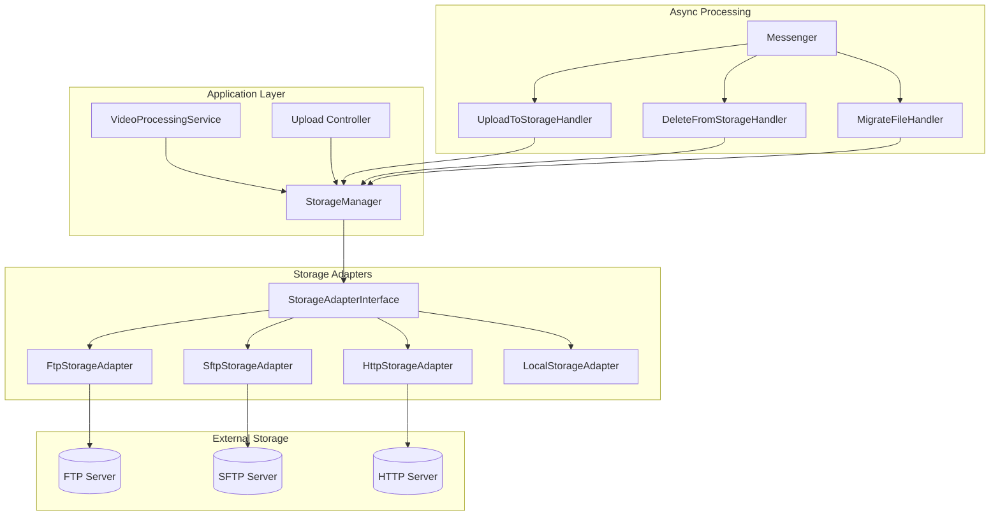

# Design Document: Remote Storage

## Overview

Система удалённых хранилищ позволяет RexTube загружать и хранить видеофайлы на внешних серверах через FTP, SFTP или HTTP API. Архитектура построена на паттерне Strategy с использованием адаптеров для каждого типа хранилища.

## Architecture



## Components and Interfaces

### StorageAdapterInterface

```php
interface StorageAdapterInterface
{
    public function upload(string $localPath, string $remotePath): bool;
    public function download(string $remotePath, string $localPath): bool;
    public function delete(string $remotePath): bool;
    public function exists(string $remotePath): bool;
    public function getUrl(string $remotePath): string;
    public function getSignedUrl(string $remotePath, int $expiresIn = 3600): string;
    public function testConnection(): ConnectionTestResult;
    public function getQuota(): ?StorageQuota;
    public function createDirectory(string $path): bool;
}
```

### Storage Entity

```php
#[ORM\Entity]
class Storage
{
    #[ORM\Id]
    #[ORM\GeneratedValue]
    #[ORM\Column]
    private ?int $id = null;

    #[ORM\Column(length: 100)]
    private string $name;

    #[ORM\Column(length: 20)]
    private string $type; // 'ftp', 'sftp', 'http', 'local'

    #[ORM\Column(type: Types::JSON)]
    private array $config = [];

    #[ORM\Column]
    private bool $isDefault = false;

    #[ORM\Column]
    private bool $isEnabled = true;

    #[ORM\Column]
    private \DateTimeImmutable $createdAt;
}
```

### FtpStorageAdapter

```php
class FtpStorageAdapter implements StorageAdapterInterface
{
    public function __construct(
        private string $host,
        private int $port,
        private string $username,
        private string $password,
        private string $basePath,
        private bool $passive = true,
        private bool $ssl = false
    ) {}
}
```

### SftpStorageAdapter

```php
class SftpStorageAdapter implements StorageAdapterInterface
{
    public function __construct(
        private string $host,
        private int $port,
        private string $username,
        private ?string $password,
        private ?string $privateKey,
        private ?string $privateKeyPassphrase,
        private string $basePath
    ) {}
}
```

### HttpStorageAdapter

```php
class HttpStorageAdapter implements StorageAdapterInterface
{
    public function __construct(
        private string $baseUrl,
        private string $uploadEndpoint,
        private string $deleteEndpoint,
        private string $authToken,
        private HttpClientInterface $httpClient
    ) {}
}
```

### StorageManager

```php
class StorageManager
{
    public function getAdapter(Storage $storage): StorageAdapterInterface;
    public function getDefaultStorage(): ?Storage;
    public function uploadFile(string $localPath, string $remotePath, ?Storage $storage = null): UploadResult;
    public function deleteFile(string $remotePath, Storage $storage): bool;
    public function getFileUrl(VideoFile $videoFile): string;
    public function migrateFile(VideoFile $videoFile, Storage $destination): bool;
}
```

### Messenger Messages

```php
class UploadToStorageMessage
{
    public function __construct(
        public readonly int $videoFileId,
        public readonly string $localPath,
        public readonly int $attempt = 1
    ) {}
}

class DeleteFromStorageMessage
{
    public function __construct(
        public readonly int $storageId,
        public readonly string $remotePath
    ) {}
}

class MigrateFileMessage
{
    public function __construct(
        public readonly int $videoFileId,
        public readonly int $destinationStorageId
    ) {}
}
```

## Data Models

### Storage Configuration JSON Schema

```json
{
  "ftp": {
    "host": "string",
    "port": "integer",
    "username": "string",
    "password": "string",
    "basePath": "string",
    "passive": "boolean",
    "ssl": "boolean"
  },
  "sftp": {
    "host": "string",
    "port": "integer",
    "username": "string",
    "authType": "password|key",
    "password": "string|null",
    "privateKey": "string|null",
    "privateKeyPassphrase": "string|null",
    "basePath": "string"
  },
  "http": {
    "baseUrl": "string",
    "uploadEndpoint": "string",
    "deleteEndpoint": "string",
    "authToken": "string",
    "authHeader": "string"
  }
}
```

### VideoFile Entity Updates

```php
// Добавить в VideoFile
#[ORM\ManyToOne]
#[ORM\JoinColumn(nullable: true)]
private ?Storage $storage = null;

#[ORM\Column(length: 500, nullable: true)]
private ?string $remotePath = null;
```

### Database Migration

```sql
CREATE TABLE storage (
    id INT AUTO_INCREMENT PRIMARY KEY,
    name VARCHAR(100) NOT NULL,
    type VARCHAR(20) NOT NULL,
    config JSON NOT NULL,
    is_default TINYINT(1) DEFAULT 0,
    is_enabled TINYINT(1) DEFAULT 1,
    created_at DATETIME NOT NULL,
    updated_at DATETIME NOT NULL
);

ALTER TABLE video_file 
ADD COLUMN storage_id INT NULL,
ADD COLUMN remote_path VARCHAR(500) NULL,
ADD CONSTRAINT fk_video_file_storage 
    FOREIGN KEY (storage_id) REFERENCES storage(id) ON DELETE SET NULL;
```

## Correctness Properties

*A property is a characteristic or behavior that should hold true across all valid executions of a system-essentially, a formal statement about what the system should do. Properties serve as the bridge between human-readable specifications and machine-verifiable correctness guarantees.*

### Property 1: Storage validation requires all mandatory fields
*For any* FTP storage configuration, validation SHALL fail if any of host, port, username, password, or basePath is empty or missing.
**Validates: Requirements 1.2, 1.3, 1.4**

### Property 2: Default storage is used for new uploads
*For any* video upload when a default storage is configured, the resulting VideoFile SHALL reference that default storage.
**Validates: Requirements 1.7**

### Property 3: Disabled storage rejects uploads
*For any* upload attempt to a disabled storage, the system SHALL throw an exception or return failure.
**Validates: Requirements 1.8**

### Property 4: Retry logic with exponential backoff
*For any* failed upload attempt N (where N < 3), the next retry SHALL occur after 2^N seconds delay.
**Validates: Requirements 2.5**

### Property 5: Successful upload stores remote path
*For any* successful upload operation, the VideoFile entity SHALL have a non-null remotePath matching the uploaded location.
**Validates: Requirements 2.7**

### Property 6: URL generation matches storage type
*For any* VideoFile with associated Storage, getFileUrl() SHALL return a URL appropriate for that storage type (proxy for FTP/SFTP, direct for HTTP).
**Validates: Requirements 3.1, 3.3**

### Property 7: Signed URLs contain signature and expiration
*For any* signed URL generated with expiration time T, the URL SHALL contain a signature parameter and expire parameter with value T.
**Validates: Requirements 3.4**

### Property 8: Migration creates jobs for all files
*For any* migration from storage A to storage B with N video files, exactly N MigrateFileMessage jobs SHALL be queued.
**Validates: Requirements 4.2**

### Property 9: Migration report accuracy
*For any* completed migration with S successes and F failures, the summary report SHALL show exactly S successful and F failed counts.
**Validates: Requirements 4.5**

### Property 10: Deletion queues jobs for all associated files
*For any* video deletion with N associated VideoFile records on remote storage, exactly N DeleteFromStorageMessage jobs SHALL be queued.
**Validates: Requirements 5.1**

### Property 11: Storage statistics accuracy
*For any* storage with N files totaling S bytes, the dashboard SHALL display count=N and size=S.
**Validates: Requirements 6.1**

### Property 12: Warning threshold at 80%
*For any* storage where used space exceeds 80% of quota, a warning notification SHALL be displayed.
**Validates: Requirements 6.3**

## Error Handling

### Connection Errors
- FTP/SFTP connection timeout: 30 seconds
- HTTP request timeout: 60 seconds
- Retry with exponential backoff: 1s, 2s, 4s (max 3 attempts)

### Upload Failures
1. Log error with full context (storage ID, file path, error message)
2. Retry up to 3 times with exponential backoff
3. After all retries fail:
   - Mark video as `processing_failed`
   - Send notification to admin
   - Keep local file for manual retry

### Delete Failures
1. Log error for manual cleanup
2. Do not block video deletion from database
3. Create cleanup task for admin review

### Migration Failures
1. Log error per file
2. Continue with remaining files
3. Generate summary report with failures
4. Allow retry of failed files

## Testing Strategy

### Unit Tests
- Storage entity validation
- URL generation logic
- Retry logic with mock adapters
- Configuration parsing

### Property-Based Tests (PHPUnit + eris/phpunit-property-based-testing)
- Storage validation for all field combinations
- URL generation for all storage types
- Retry timing calculations
- Statistics calculations

### Integration Tests
- FTP adapter with local FTP server (Docker)
- SFTP adapter with local SFTP server (Docker)
- HTTP adapter with mock HTTP server
- Full upload/download cycle

### Functional Tests
- Admin storage management pages
- Video upload with remote storage
- Video playback from remote storage
- Migration workflow
