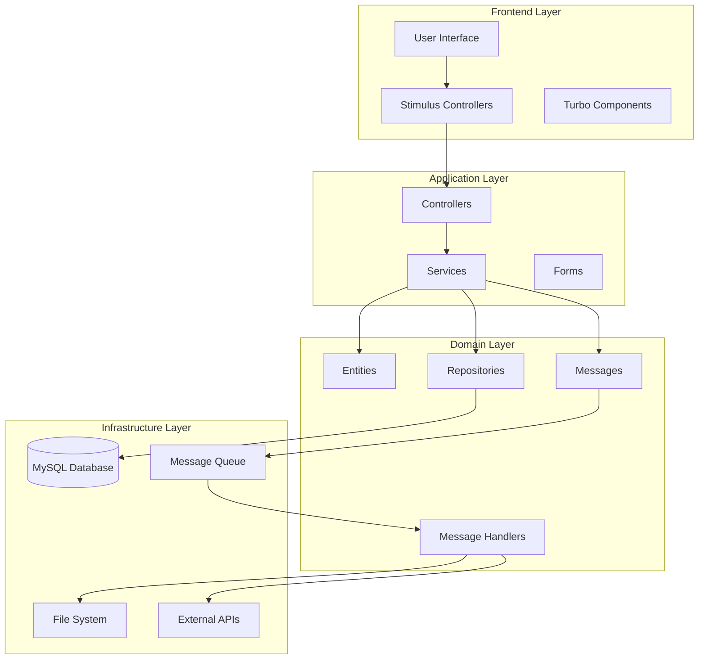

# Design Document: User Engagement Features

## Overview

Данный документ описывает архитектурное решение для расширения функциональности RexTube с целью повышения пользовательского взаимодействия. Система включает 13 основных функций: плейлисты, историю просмотров, лайки/дизлайки, подписки, закладки, рекомендации, расширенную фильтрацию, улучшенные комментарии, шаринг, профили пользователей, связанные видео, серии/сезоны и анимированные превью.

Решение построено на существующей архитектуре Symfony 8.0 с использованием Doctrine ORM, Symfony Messenger для асинхронной обработки и современного фронтенда на базе Stimulus/Turbo.

## Architecture

### High-Level Architecture



### Component Interaction

Система использует многослойную архитектуру с четким разделением ответственности:

- **Frontend Layer**: Stimulus контроллеры обеспечивают интерактивность, Turbo - SPA-подобную навигацию
- **Application Layer**: Контроллеры обрабатывают HTTP-запросы, сервисы содержат бизнес-логику
- **Domain Layer**: Сущности представляют доменные объекты, репозитории - доступ к данным
- **Infrastructure Layer**: База данных, файловая система, очереди сообщений

## Components and Interfaces

### Core Entities

#### Playlist Entity
```php
class Playlist
{
    private int $id;
    private string $name;
    private ?string $description;
    private User $owner;
    private bool $isPublic;
    private Collection $playlistItems; // PlaylistItem[]
    private DateTime $createdAt;
    private DateTime $updatedAt;
}

class PlaylistItem
{
    private int $id;
    private Playlist $playlist;
    private Video $video;
    private int $position;
    private DateTime $addedAt;
}
```

#### WatchHistory Entity
```php
class WatchHistory
{
    private int $id;
    private User $user;
    private Video $video;
    private DateTime $watchedAt;
    private int $watchDuration; // seconds
}
```

#### VideoRating Entity
```php
class VideoRating
{
    private int $id;
    private User $user;
    private Video $video;
    private string $type; // 'like' or 'dislike'
    private DateTime $createdAt;
}
```

#### Subscription Entity
```php
class Subscription
{
    private int $id;
    private User $subscriber;
    private User $author;
    private DateTime $subscribedAt;
    private bool $notificationsEnabled;
}
```

#### Bookmark Entity
```php
class Bookmark
{
    private int $id;
    private User $user;
    private Video $video;
    private DateTime $bookmarkedAt;
}
```

#### VideoSeries Entity
```php
class VideoSeries
{
    private int $id;
    private string $title;
    private ?string $description;
    private User $creator;
    private ?string $coverImage;
    private Collection $seasons; // VideoSeason[]
    private DateTime $createdAt;
}

class VideoSeason
{
    private int $id;
    private VideoSeries $series;
    private string $title;
    private int $seasonNumber;
    private Collection $episodes; // VideoEpisode[]
}

class VideoEpisode
{
    private int $id;
    private VideoSeason $season;
    private Video $video;
    private int $episodeNumber;
    private string $title;
}
```

#### UserProfile Extension
```php
// Расширение существующей сущности User
class User
{
    // ... existing fields
    private ?string $avatar;
    private ?string $biography;
    private int $subscribersCount;
    private DateTime $profileUpdatedAt;
}
```

### Service Layer

#### PlaylistService
```php
interface PlaylistServiceInterface
{
    public function createPlaylist(User $user, string $name, ?string $description, bool $isPublic): Playlist;
    public function addVideoToPlaylist(Playlist $playlist, Video $video): PlaylistItem;
    public function removeVideoFromPlaylist(Playlist $playlist, Video $video): void;
    public function reorderPlaylist(Playlist $playlist, array $videoIds): void;
    public function getUserPlaylists(User $user): array;
}
```

#### WatchHistoryService
```php
interface WatchHistoryServiceInterface
{
    public function recordWatch(User $user, Video $video, int $duration): WatchHistory;
    public function getUserHistory(User $user, int $limit = 50): array;
    public function clearUserHistory(User $user): void;
    public function removeFromHistory(User $user, Video $video): void;
}
```

#### RecommendationService
```php
interface RecommendationServiceInterface
{
    public function getRecommendationsForUser(User $user, int $limit = 10): array;
    public function getRelatedVideos(Video $video, int $limit = 5): array;
    public function updateUserPreferences(User $user, Video $video): void;
}
```

#### VideoProcessingService (Extended)
```php
interface VideoProcessingServiceInterface
{
    // ... existing methods
    public function generateAnimatedPreview(Video $video): string;
    public function generateVideoThumbnails(Video $video, int $count = 5): array;
}
```

### Message Handlers

#### GeneratePreviewMessage
```php
class GeneratePreviewMessage
{
    private int $videoId;
    
    public function __construct(int $videoId)
    {
        $this->videoId = $videoId;
    }
}

class GeneratePreviewMessageHandler
{
    public function __invoke(GeneratePreviewMessage $message): void
    {
        // Generate animated WebP/GIF preview using FFmpeg
    }
}
```

#### NotificationMessage
```php
class NotificationMessage
{
    private int $userId;
    private string $type;
    private array $data;
}

class NotificationMessageHandler
{
    public function __invoke(NotificationMessage $message): void
    {
        // Send email/push notifications
    }
}
```

### Frontend Components

#### Stimulus Controllers

```javascript
// playlist_controller.js
export default class extends Controller {
    static targets = ["item", "form"]
    
    addVideo(event) {
        // Add video to playlist via AJAX
    }
    
    reorder(event) {
        // Handle drag & drop reordering
    }
}

// video_preview_controller.js
export default class extends Controller {
    static values = { previewUrl: String }
    
    showPreview() {
        // Show animated preview on hover
    }
    
    hidePreview() {
        // Hide preview and return to static poster
    }
}

// rating_controller.js
export default class extends Controller {
    like(event) {
        // Handle like button click
    }
    
    dislike(event) {
        // Handle dislike button click
    }
}
```

## Data Models

### Database Schema Extensions

```sql
-- Playlists
CREATE TABLE playlist (
    id INT AUTO_INCREMENT PRIMARY KEY,
    name VARCHAR(255) NOT NULL,
    description TEXT,
    owner_id INT NOT NULL,
    is_public BOOLEAN DEFAULT TRUE,
    created_at DATETIME NOT NULL,
    updated_at DATETIME NOT NULL,
    FOREIGN KEY (owner_id) REFERENCES user(id) ON DELETE CASCADE
);

CREATE TABLE playlist_item (
    id INT AUTO_INCREMENT PRIMARY KEY,
    playlist_id INT NOT NULL,
    video_id INT NOT NULL,
    position INT NOT NULL,
    added_at DATETIME NOT NULL,
    FOREIGN KEY (playlist_id) REFERENCES playlist(id) ON DELETE CASCADE,
    FOREIGN KEY (video_id) REFERENCES video(id) ON DELETE CASCADE,
    UNIQUE KEY unique_playlist_video (playlist_id, video_id)
);

-- Watch History
CREATE TABLE watch_history (
    id INT AUTO_INCREMENT PRIMARY KEY,
    user_id INT NOT NULL,
    video_id INT NOT NULL,
    watched_at DATETIME NOT NULL,
    watch_duration INT DEFAULT 0,
    FOREIGN KEY (user_id) REFERENCES user(id) ON DELETE CASCADE,
    FOREIGN KEY (video_id) REFERENCES video(id) ON DELETE CASCADE,
    UNIQUE KEY unique_user_video (user_id, video_id)
);

-- Video Ratings
CREATE TABLE video_rating (
    id INT AUTO_INCREMENT PRIMARY KEY,
    user_id INT NOT NULL,
    video_id INT NOT NULL,
    type ENUM('like', 'dislike') NOT NULL,
    created_at DATETIME NOT NULL,
    FOREIGN KEY (user_id) REFERENCES user(id) ON DELETE CASCADE,
    FOREIGN KEY (video_id) REFERENCES video(id) ON DELETE CASCADE,
    UNIQUE KEY unique_user_video_rating (user_id, video_id)
);

-- Subscriptions
CREATE TABLE subscription (
    id INT AUTO_INCREMENT PRIMARY KEY,
    subscriber_id INT NOT NULL,
    author_id INT NOT NULL,
    subscribed_at DATETIME NOT NULL,
    notifications_enabled BOOLEAN DEFAULT TRUE,
    FOREIGN KEY (subscriber_id) REFERENCES user(id) ON DELETE CASCADE,
    FOREIGN KEY (author_id) REFERENCES user(id) ON DELETE CASCADE,
    UNIQUE KEY unique_subscription (subscriber_id, author_id)
);

-- Bookmarks
CREATE TABLE bookmark (
    id INT AUTO_INCREMENT PRIMARY KEY,
    user_id INT NOT NULL,
    video_id INT NOT NULL,
    bookmarked_at DATETIME NOT NULL,
    FOREIGN KEY (user_id) REFERENCES user(id) ON DELETE CASCADE,
    FOREIGN KEY (video_id) REFERENCES video(id) ON DELETE CASCADE,
    UNIQUE KEY unique_user_bookmark (user_id, video_id)
);

-- Video Series
CREATE TABLE video_series (
    id INT AUTO_INCREMENT PRIMARY KEY,
    title VARCHAR(255) NOT NULL,
    description TEXT,
    creator_id INT NOT NULL,
    cover_image VARCHAR(255),
    created_at DATETIME NOT NULL,
    FOREIGN KEY (creator_id) REFERENCES user(id) ON DELETE CASCADE
);

CREATE TABLE video_season (
    id INT AUTO_INCREMENT PRIMARY KEY,
    series_id INT NOT NULL,
    title VARCHAR(255) NOT NULL,
    season_number INT NOT NULL,
    FOREIGN KEY (series_id) REFERENCES video_series(id) ON DELETE CASCADE
);

CREATE TABLE video_episode (
    id INT AUTO_INCREMENT PRIMARY KEY,
    season_id INT NOT NULL,
    video_id INT NOT NULL,
    episode_number INT NOT NULL,
    title VARCHAR(255) NOT NULL,
    FOREIGN KEY (season_id) REFERENCES video_season(id) ON DELETE CASCADE,
    FOREIGN KEY (video_id) REFERENCES video(id) ON DELETE CASCADE
);

-- User Profile Extensions
ALTER TABLE user ADD COLUMN avatar VARCHAR(255);
ALTER TABLE user ADD COLUMN biography TEXT;
ALTER TABLE user ADD COLUMN subscribers_count INT DEFAULT 0;
ALTER TABLE user ADD COLUMN profile_updated_at DATETIME;

-- Video Extensions for Previews
ALTER TABLE video ADD COLUMN animated_preview VARCHAR(255);
ALTER TABLE video ADD COLUMN likes_count INT DEFAULT 0;
ALTER TABLE video ADD COLUMN dislikes_count INT DEFAULT 0;
```

### Recommendation Algorithm Data

```sql
-- User Preferences (для алгоритма рекомендаций)
CREATE TABLE user_preference (
    id INT AUTO_INCREMENT PRIMARY KEY,
    user_id INT NOT NULL,
    category_id INT,
    tag_id INT,
    author_id INT,
    weight DECIMAL(3,2) DEFAULT 1.0,
    updated_at DATETIME NOT NULL,
    FOREIGN KEY (user_id) REFERENCES user(id) ON DELETE CASCADE,
    FOREIGN KEY (category_id) REFERENCES category(id) ON DELETE CASCADE,
    FOREIGN KEY (tag_id) REFERENCES tag(id) ON DELETE CASCADE,
    FOREIGN KEY (author_id) REFERENCES user(id) ON DELETE CASCADE
);
```
## Correctness Properties

*Свойство - это характеристика или поведение, которое должно выполняться во всех допустимых выполнениях системы - по сути, формальное утверждение о том, что система должна делать. Свойства служат мостом между человекочитаемыми спецификациями и машинно-проверяемыми гарантиями корректности.*

### Property 1: Playlist Creation Consistency
*Для любого* пользователя и валидных данных плейлиста (название, описание, приватность), создание плейлиста должно результировать в сохранении плейлиста с правильными атрибутами и владельцем
**Validates: Requirements 1.1**

### Property 2: Playlist Video Addition Order
*Для любого* существующего плейлиста и видео, добавление видео в плейлист должно поместить его в конец списка с правильной позицией
**Validates: Requirements 1.2**

### Property 3: Playlist Reordering Consistency
*Для любого* плейлиста с видео, изменение порядка видео должно корректно обновить позиции всех элементов согласно новому порядку
**Validates: Requirements 1.3**

### Property 4: Playlist Video Removal Safety
*Для любого* плейлиста содержащего видео, удаление видео из плейлиста должно удалить только связь, оставив само видео в системе неизменным
**Validates: Requirements 1.4**

### Property 5: Playlist Privacy Enforcement
*Для любого* плейлиста с установленной приватностью, доступ к плейлисту должен соответствовать настройкам приватности (публичный доступен всем, приватный - только владельцу)
**Validates: Requirements 1.5**

### Property 6: Watch History Recording Threshold
*Для любого* пользователя и видео, просмотр видео более 10 секунд должен создать или обновить запись в истории просмотров с корректной временной меткой
**Validates: Requirements 2.1**

### Property 7: Watch History Chronological Order
*Для любого* пользователя с историей просмотров, получение истории должно возвращать записи в хронологическом порядке (новые сверху)
**Validates: Requirements 2.2**

### Property 8: Watch History Selective Removal
*Для любого* пользователя и записи в истории, удаление конкретной записи должно удалить только её, не затрагивая другие записи истории
**Validates: Requirements 2.3**

### Property 9: Watch History Complete Clearing
*Для любого* пользователя, очистка истории должна удалить все записи истории этого пользователя, не затрагивая данные других пользователей
**Validates: Requirements 2.4**

### Property 10: Watch History Update on Rewatch
*Для любого* видео уже присутствующего в истории пользователя, повторный просмотр должен обновить временную метку существующей записи, а не создавать дубликат
**Validates: Requirements 2.5**

### Property 11: Video Rating Like Increment
*Для любого* авторизованного пользователя и видео, постановка лайка должна увеличить счетчик лайков на 1 и сохранить оценку пользователя
**Validates: Requirements 3.1**

### Property 12: Video Rating Dislike Increment
*Для любого* авторизованного пользователя и видео, постановка дизлайка должна увеличить счетчик дизлайков на 1 и сохранить оценку пользователя
**Validates: Requirements 3.2**

### Property 13: Video Rating Change Consistency
*Для любого* пользователя меняющего оценку с лайка на дизлайк, система должна уменьшить счетчик лайков на 1 и увеличить счетчик дизлайков на 1
**Validates: Requirements 3.3**

### Property 14: Video Rating Cancellation
*Для любого* пользователя повторно нажимающего на свою текущую оценку, система должна отменить оценку и уменьшить соответствующий счетчик на 1
**Validates: Requirements 3.4**

### Property 15: Subscription Creation and Counter Update
*Для любого* пользователя подписывающегося на автора, система должна создать подписку и увеличить счетчик подписчиков автора на 1
**Validates: Requirements 4.1**

### Property 16: Subscription Removal and Counter Update
*Для любого* пользователя отписывающегося от автора, система должна удалить подписку и уменьшить счетчик подписчиков автора на 1
**Validates: Requirements 4.2**

### Property 17: New Video Notification to Subscribers
*Для любого* автора публикующего новое видео, система должна отправить уведомления всем его подписчикам с включенными уведомлениями
**Validates: Requirements 4.3**

### Property 18: Subscription Feed Content
*Для любого* пользователя с подписками, страница подписок должна содержать всех авторов на которых он подписан с их последними видео
**Validates: Requirements 4.4**

### Property 19: Bookmark Addition
*Для любого* пользователя и видео, добавление в избранное должно создать запись закладки с корректной временной меткой
**Validates: Requirements 5.1**

### Property 20: Bookmark Removal
*Для любого* пользователя и видео в его закладках, удаление из избранного должно удалить соответствующую запись закладки
**Validates: Requirements 5.2**

### Property 21: Bookmark Chronological Sorting
*Для любого* пользователя с закладками, получение списка избранного должно возвращать закладки отсортированные по дате добавления
**Validates: Requirements 5.3**

### Property 22: Personalized Recommendations Based on History
*Для любого* пользователя с достаточной историей просмотров, рекомендации должны включать видео из категорий, тегов и авторов присутствующих в его истории
**Validates: Requirements 6.1, 6.4**

### Property 23: Fallback Recommendations for New Users
*Для любого* пользователя с недостаточной историей просмотров, рекомендации должны включать популярные видео из категорий которые он просматривал
**Validates: Requirements 6.2**

### Property 24: User Preferences Update on Watch
*Для любого* пользователя просматривающего видео, система должна обновить его профиль предпочтений учитывая категории, теги и автора видео
**Validates: Requirements 6.3**

### Property 25: Video Duration Filtering
*Для любого* выбранного диапазона длительности, фильтрация должна возвращать только видео соответствующие этому диапазону (короткие <5мин, средние 5-20мин, длинные >20мин)
**Validates: Requirements 7.1**

### Property 26: Video Date Sorting
*Для любого* направления сортировки по дате, результаты должны быть отсортированы по дате публикации в соответствующем порядке (новые/старые)
**Validates: Requirements 7.2**

### Property 27: Video Popularity Sorting
*Для любого* запроса с сортировкой по популярности, результаты должны быть отсортированы по количеству просмотров в убывающем порядке
**Validates: Requirements 7.3**

### Property 28: Video Rating Sorting
*Для любого* запроса с сортировкой по рейтингу, результаты должны быть отсортированы по соотношению лайков к дизлайкам в убывающем порядке
**Validates: Requirements 7.4**

### Property 29: Multiple Filters Combination
*Для любого* набора фильтров, применение всех фильтров должно возвращать видео удовлетворяющие всем условиям одновременно
**Validates: Requirements 7.5**

### Property 30: Filter Reset to Default
*Для любого* состояния с примененными фильтрами, сброс фильтров должен вернуть отображение к настройкам по умолчанию
**Validates: Requirements 7.6**

### Property 31: Nested Comment Creation and Notification
*Для любого* пользователя отвечающего на комментарий, система должна создать вложенный комментарий и отправить уведомление автору родительского комментария
**Validates: Requirements 8.1**

### Property 32: Mention Notification
*Для любого* комментария содержащего упоминание @username, система должна отправить уведомление упомянутому пользователю
**Validates: Requirements 8.2**

### Property 33: Mention Link Rendering
*Для любого* комментария содержащего упоминание @username, отображение должно содержать кликабельную ссылку на профиль упомянутого пользователя
**Validates: Requirements 8.4**

### Property 34: Social Share URL Generation
*Для любого* видео и выбранной социальной сети, система должна генерировать корректную ссылку для шаринга с предзаполненными данными
**Validates: Requirements 9.2**

### Property 35: Open Graph Meta Tags Generation
*Для любого* видео, генерация ссылки для шаринга должна включать корректные Open Graph метатеги для превью
**Validates: Requirements 9.4**

### Property 36: Avatar Upload and Storage
*Для любого* пользователя загружающего валидный аватар, система должна сохранить изображение и обновить профиль пользователя
**Validates: Requirements 10.1**

### Property 37: Biography Update
*Для любого* пользователя редактирующего биографию, система должна сохранить новый текст и обновить профиль
**Validates: Requirements 10.2**

### Property 38: Profile Data Retrieval
*Для любого* запроса профиля пользователя, система должна возвращать актуальные данные: аватар, биографию, количество видео и подписчиков
**Validates: Requirements 10.3**

### Property 39: Avatar Format Validation
*Для любого* файла неподдерживаемого формата, загрузка аватара должна быть отклонена с соответствующим сообщением об ошибке
**Validates: Requirements 10.4**

### Property 40: Avatar Size Processing
*Для любого* аватара превышающего максимальный размер, система должна автоматически сжать изображение до допустимого размера
**Validates: Requirements 10.5**

### Property 41: Related Videos Algorithm
*Для любого* видео, система должна возвращать связанные видео учитывая общие теги, категорию и автора
**Validates: Requirements 11.1, 11.2**

### Property 42: Series Videos Priority
*Для любого* видео являющегося частью серии, связанные видео должны приоритетно включать другие видео из той же серии
**Validates: Requirements 11.3**

### Property 43: Related Videos Fallback
*Для любого* видео с недостаточным количеством связанных видео, список должен быть дополнен популярными видео из той же категории
**Validates: Requirements 11.4**

### Property 44: Video Series Creation
*Для любого* автора создающего серию с валидными данными, система должна создать контейнер серии с указанными названием, описанием и обложкой
**Validates: Requirements 12.1**

### Property 45: Video Episode Assignment
*Для любого* видео добавляемого в серию, система должна присвоить ему номер эпизода и установить связь с серией
**Validates: Requirements 12.2**

### Property 46: Season Creation in Series
*Для любого* автора создающего сезон в серии, система должна создать подгруппу для организации эпизодов с правильным номером сезона
**Validates: Requirements 12.3**

### Property 47: Series Content Ordering
*Для любой* серии с сезонами и эпизодами, отображение должно показывать все сезоны и эпизоды в правильном хронологическом порядке
**Validates: Requirements 12.4**

### Property 48: Series Navigation
*Для любого* видео из серии, система должна предоставить навигацию к предыдущему и следующему эпизоду в правильном порядке
**Validates: Requirements 12.5**

### Property 49: Series Autoplay Suggestion
*Для любого* завершенного эпизода серии, система должна предложить автовоспроизведение следующего эпизода если он существует
**Validates: Requirements 12.6**

### Property 50: Animated Preview Generation
*Для любого* загруженного видео, система должна автоматически генерировать анимированное превью в формате WebP или GIF
**Validates: Requirements 13.3**

### Property 51: Preview Fallback to Static
*Для любого* видео без доступного анимированного превью, система должна отображать статичный постер
**Validates: Requirements 13.4**

### Property 52: Mobile Preview Optimization
*Для любого* пользователя на мобильном устройстве, система должна отключить автоматическое воспроизведение превью для экономии трафика
**Validates: Requirements 13.5**

## Error Handling

### Input Validation
- **Playlist Names**: Максимум 255 символов, не пустое
- **Biography**: Максимум 1000 символов
- **Avatar Files**: Поддерживаемые форматы (JPEG, PNG, WebP), максимум 5MB
- **Video Series**: Название обязательно, описание опционально

### Error Scenarios
- **Unauthorized Access**: Перенаправление на страницу авторизации
- **Duplicate Actions**: Предотвращение дублирования лайков, подписок, закладок
- **Missing Resources**: Graceful handling отсутствующих видео, пользователей
- **File Processing Errors**: Fallback к статичным превью при ошибках генерации

### Rate Limiting
- **API Endpoints**: Ограничение запросов для предотвращения спама
- **File Uploads**: Ограничение количества загрузок аватаров в час
- **Notifications**: Throttling уведомлений для предотвращения спама

## Testing Strategy

### Dual Testing Approach
Система тестирования включает два взаимодополняющих подхода:

**Unit Tests**:
- Тестирование конкретных примеров и граничных случаев
- Проверка интеграционных точек между компонентами
- Тестирование обработки ошибок и исключительных ситуаций
- Валидация бизнес-логики сервисов

**Property-Based Tests**:
- Проверка универсальных свойств на множестве сгенерированных входных данных
- Каждое свойство корректности должно быть реализовано отдельным property-based тестом
- Минимум 100 итераций на каждый property test
- Тегирование тестов: **Feature: user-engagement-features, Property {number}: {property_text}**

### Testing Framework Configuration
- **PHP Testing**: PHPUnit 10+ с поддержкой property-based testing через Eris
- **JavaScript Testing**: Jest с fast-check для property-based тестов
- **Database Testing**: Doctrine Fixtures для создания тестовых данных
- **Integration Testing**: Symfony WebTestCase для тестирования HTTP endpoints

### Test Data Generation
- **Smart Generators**: Генераторы ограничивают входное пространство разумными пределами
- **Realistic Data**: Использование реалистичных данных для видео, пользователей, комментариев
- **Edge Cases**: Специальные генераторы для граничных случаев (пустые плейлисты, длинные биографии)

### Continuous Testing
- **Automated Testing**: Запуск всех тестов при каждом коммите
- **Performance Testing**: Мониторинг производительности алгоритмов рекомендаций
- **Load Testing**: Тестирование под нагрузкой для асинхронной обработки видео

Каждый property test должен ссылаться на соответствующее свойство из дизайн-документа и проверять универсальную корректность системы на широком спектре входных данных.